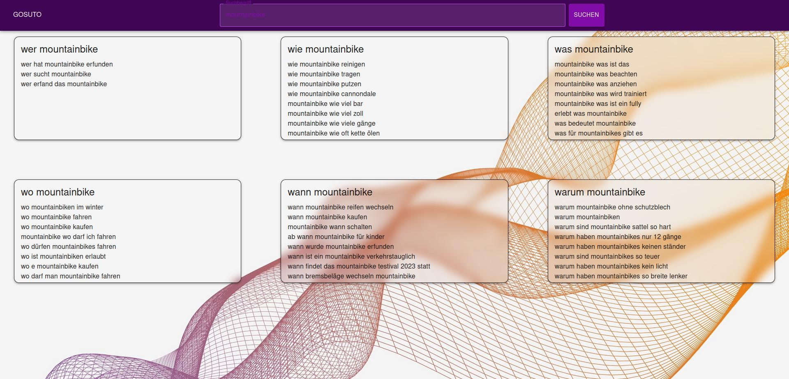

# google_suggestions_tool
Small fun project which uses the Google suggestion api to generate the most frequently searched questions for a keyword

Repository is actually work in progress.

# Usage
- clone repository
- install docker and docker-compose 
- run `docker-compose up` in root directory of repository
- you can reach the frontend on http://localhost:3000

# For Development

## Start rotating Proxy
`docker-compose up -d rproxy`

## Start backend
`uvicorn backend.main:app --reload`

## request suggestions
Send request with keyword to `http://localhost:8000/{keyword}`

e.g.:
`curl --request GET --url http://127.0.0.1:8000/mountainbike`

## Start frontend
`cd frontend && npm start`

# ToDo's
- [x] Basic functionality
- [x] Containerization
- [x] CI Pipeline
- [x] Add loading/error handling in frontend
- [ ] Increase test coverage to 100%
- [x] Implement Rotating Proxy
- [ ] Add multilanguage support